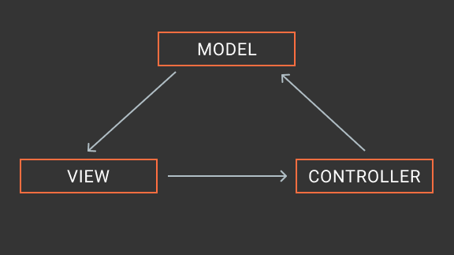

# AngularServiceStorePattern

ToDo application that implements a service store pattern following an MVC approach for data management.

### How to run it

1. `npm ci` - install dependencies
2. `npm run start` - run the application
